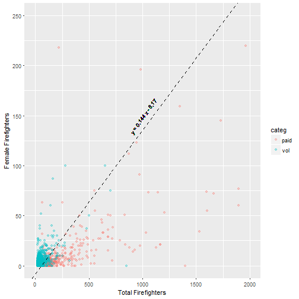

# The Survey

## Background

* Fire Service Survey
* 5458 Records (respondents)
* Year unknown, post 2011 (per Q5)

---


## Suggestions for improvement to survey

* Questions prompting numeric responses unnecessarily broken out into ordinal variables reduces data granularity
    * Number of buildings with 3+ stories (Q3)
    * Minimum staffing (Q7-Q10)
* Some questions poorly binned, resulting in skipped ranges and requiring "other" category
    * Firefighter fitness (Q22d/f)
* Inconsistent binning choice across similar questions
    * Hazmat training level prompts for precise percentages
    * Other types of training ask respondent to check a box representing a range
  

## But most importantly...

### Migrate to electronic survey platform
* Minimize errors from multiple human data-entry steps
* Automatic data integrity checks (e.g. percents add up to 100)
* Ensure necessary questions are not left blank


## Suggestions for improvement to dataset

* Inconsistent null representations
    * Empty cells
    * '#NULL!'
    * NA
    * White space
* Columns out of order
    * Column order should align with ordering in survey
    * At first glance, it appears that Q31 is incomplete, and Q32-46 and all of PART VIII are missing
  
<div class="notes">
### Cleaning Nulls
* For the purpose of this analysis, it is assumed that null entries on questions asking for numeric values are equivalent to a reponse of "0"
* Cleaning in this fashion had the additional effect of creating a new "null" category on questions associated with categorical/ordinal variables, since categories are otherwise 1-indexed in the data
* Normally I would advise performing this kind of cleaning operation on a variable-by-variable basis. Broad strokes are dangerous, but time was limited in this analysis.
</div>


## Suggestions for improvement to dataset

### Large numeric values used xx,xxx comma delimiting
* Forces coersion to text
* Necessitates otherwise unnecessary data cleaning step
* Fewer characters for data entry = less work for data entry personnel

<div class="notes">
### Cleaning Numbers
* Stripped commas prior to numeric coersion, being careful to avoid stripping 
  commas from text columns
</div>

  
# FINDINGS

## Overview

* Staffing levels (paid) are stable
* Women have stronger representation in volunteer departments


## Staffing levels (paid) are stable

52% of departments have no full-time paid personnel. Of those that have paid personnel, 99% of departments are within 2% of paid staffing levels from 2011. 


## Representation of Women

* Controlling for department size, women have higher representation in volunteer departments
* 21% of volunteer departments had at least 14% female staff, whereas only 1% of paid departments did.

## Decision Boundary

Approximately 14% representation



## Representation of Women: Boring technical details

* Logistic regression
* Relative effect on odds ratio of female_ff vs total_ff: 7x

```
    is_volunteer_dept ~ total_ff + female_ff

             Estimate Std. Error z value Pr(>|z|)    
(Intercept)  1.641406   0.061250   26.80   <2e-16 ***
female_ff    0.200858   0.012611   15.93   <2e-16 ***
total_ff    -0.028968   0.001392  -20.81   <2e-16 ***
```  

## Model Validation

* Bootstrapped accuracy: 77.0% (95% CI: 75.3% - 78.7%), 
* p < 0.005 (permutation test)
* Area Under ROC Curve: 0.84


<div class="notes">
* 2000 bo0tstrap iterations, found to give same results as 200 iterations
* 200 Target shuffling iterations over 200 bootstrap iterations
</div>

---


## Future work

* More closely investigate variables associated with FD needs
* Be more careful with null data
* Revisit gender analysis with zero-inflated modeling
* Play with free text fields
