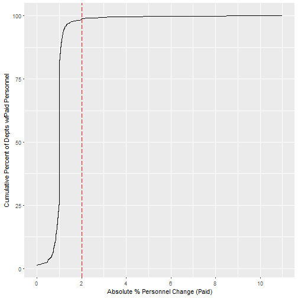

Fire Service Survey: Initial Exploration and insights
========================================================
author: David Marx
date: 2/3/2017
autosize: true
font-family: 'Helvetica'

Background
========================================================

* Applying for Senior Data Scientist Position at NFPA
* Assigned data analysis task as part of evaluation
* Asked to limit effort to 3-5 hours
* Written report + presentation
* The Dataset
  * Fire Service Survey
  * 5458 Records (respondents)
  * Year unknown, post 2011 (per Q5)

Suggestions for improvement to survey
========================================================

* Questions prompting numeric responses unnecessarily broken out into ordinal variables reduces data granularity
  * Number of buildings with 3+ stories (Q3)
  * Minimum staffing (Q7-Q10)
* Some questions poorly binned, resulting in skipped ranges and requiring "other" category
  * Firefighter fitness (Q22d/f)
* Inconsistent binning choice across similar questions
  * Hazmat training level prompts for precise percentages
  * Other types of training ask respondent to check a box representing a range
* Migrate to electronic survey platform
  * Minimize errors from multiple human data-entry steps
  * Automatic data integrity checks (e.g. percents add up to 100)
  * Ensure necessary questions are not left blank

Suggestions for improvement to dataset
========================================================

### Inconsistent null representations
* Empty cells
* '#NULL!'
* NA
* White space
### Columns out of order
  * Column order should align with ordering in survey
  * At first glance, it appears that Q31 is incomplete, and Q32-46 and all of PART VIII are missing
  
### Large numeric values used xx,xxx comma delimiting
* Forces coersion to text
* Necessitates otherwise unnecessary data cleaning step
* Fewer characters for data entry = less work for data entry personnel

Preparing Data
========================================================
### Cleaning Nulls
* For the purpose of this analysis, it is assumed that null entries on questions asking for numeric values are equivalent to a reponse of "0"
* Cleaning in this fashion had the additional effect of creating a new "null" category on questions associated with categorical/ordinal variables, since categories are otherwise 1-indexed in the data
* Normally I would advise performing this kind of cleaning operation on a variable-by-variable basis. Broad strokes are dangerous, but time was limited in this analysis.

### Cleaning Numbers
* Stripped commas prior to numeric coersion, being careful to avoid stripping 
  commas from text columns

Findings
========================================================

52% of departments have no full-time paid personnel. Of those that have paid personnel, 99% of departments are within 2% of paid staffing levels from 2011. 

